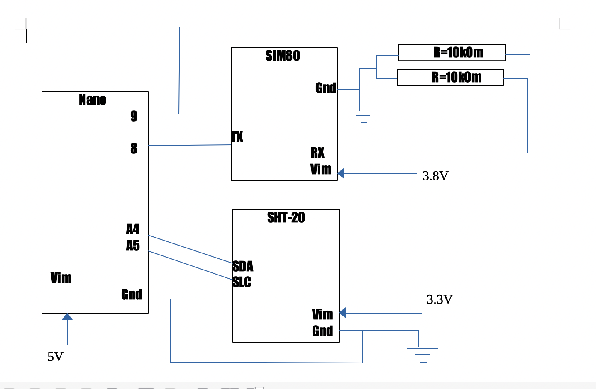

# GiveMeTempSMS

## MOTIVATION

A friend of mine has got a countryside house.
He wants to control a boiler, especially in winter.
But the house is distant and Internet is not provided.
So we designed a device which replies on a code SMS with 
requested information. In my friends' case, with temperature measured.

## INGREDIENTS

- [Arduino Nano](https://arduino.ua/prod2177-arduino-nano-v3-0-avr-atmega328-p-20au)
- [SIM800L](https://arduino.ua/prod1665-gsm-modyl-na-sim800l)
- [SHT20 I2C](https://arduino.ua/prod4499-modyl-datchika-temperatyri-i-vlajnosti-sht20-i2c)
- Power supply and miscellaneous

## Enjoy
We hope you will be interested in repeating this project
